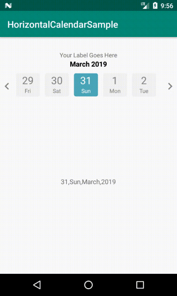

# Horizontal Calendar Android Library Sample
<a href='https://bintray.com/sahanab/HorizontalCalendarView/HorizontalCalendarView?source=watch' alt='Get automatic notifications about new "HorizontalCalendarView" versions'></a><a href='https://bintray.com/sahanab/HorizontalCalendarView/HorizontalCalendarView?source=watch' alt='Get automatic notifications about new "HorizontalCalendarView" versions'></a>

[  ](https://bintray.com/sahanab/HorizontalCalendarView/HorizontalCalendarView/_latestVersion)   [  ](https://bintray.com/sahanab/HorizontalCalendarView/HorizontalCalendarView/1.0.2/link)
[  ](https://bintray.com/sahanab/HorizontalCalendarView/HorizontalCalendarView/1.0.1/link)

# Android Horizontal Calendar
Migrated to Androidx and upgraded to latest sdks

Android Horizontal Calendar with Recyclerview is an easy library to customize horizontal calendar view with selecting center item.

# Features
- Supporting multiple languages calendar dynamically.
- Customizable left and right icons color.
- Customizable text color and size ,background color and font, number of days to display.
- minSdkVersion 21
- 
## Default


## Installation

Latest version of the library can be found on Maven Central.

# For Gradle users
Open your ```build.gradle``` Then, include the library as dependency:

```    
implementation 'io.github.b-sahana:horizontalcalendar:1.2.1'
```

# For Maven users
Add this dependency to your ```pom.xml```:
```
<dependency>
  <groupId>io.github.b-sahana</groupId>
  <artifactId>horizontalcalendar</artifactId>
  <version>1.2.1</version>
  <type>aar</type>
</dependency>
```
## Usage

Please see the ```Horizontal-Calendar-Sample```  for a more detailed code example of how to use the library.

1.Add the ```HorizontalCalendar``` view to the layout you want to show.
```
<com.sahana.horizontalcalendar.HorizontalCalendar
        android:id="@+id/horizontalCalendar"
        android:layout_width="match_parent"
        android:layout_height="wrap_content"
        android:layout_marginTop="10dp"
        app:numOfDays="90"
        app:setBgColor="@color/colorPrimary"
        app:setSelectedBgColor="@color/colorAccent"
        app:setTextColor="@color/white"
        app:setSelectedTextColor="@color/white"
        app:setDateTextSize="@dimen/twenty_two_sp"
        app:setWeekTextSize="13sp"
        app:setMonthTextSize="17sp"
        app:setDateFontStyle="@string/light"
        app:setLabelFontStyle="@string/bold"
        app:setMonthFontStyle="@string/bold"
        app:setLabel="@string/label"/>
 ```      
2.Configure attributes.
- ```numOfDays``` - to set number of days to display in horizontal calendar (default: 60 days).

- ```setLabel``` - to set your title/label to view.

- ```setBgColor``` - to set backgroundcolor when user not selected  (default: light gray (#f2f2f2) ).

- ```setTextColor``` - to set text color when user not selected (default: drak gray (#FF858585) ).

- ```setSelectedBgColor``` - to set backgroundcolor when user selected (default: sky blue (#4ba6bb) ).

- ```setSelectedTextColor``` - to set text color when user selected (default: white ).

- ```setScrollSpeed``` - to set scroll speed of view when pressed for long on arrow marks\icons (default: 30).
     - If you want scroll speed to be slow then set the ```setScrollSpeed``` value below 30 (only positive Integers allowed).
     
- ```setMonthColor``` - to set ```Month and Year``` text color (default: black).

- ```setLabelTextSize``` - to set title/label text size in SP (default: 13sp) .

- ```setMonthTextSize``` - to ```Month and Year``` text size in SP (default: 15sp) .

- ```setDateTextSize``` - to set date text size in SP (default: 22sp) .

- ```setWeekTextSize``` - to set ```week``` text size in SP (default: 12sp) .

- ```setLabelFontStyle``` - to set title/label font(typeface).

- ```setMonthFontStyle``` - to set ```Month and Year``` font(typeface).

- ```setDateFontStyle``` - to set ```Date and Week``` font(typeface).

- ```setIconsColor``` - to set left and right icons color.

- ```setLanguage``` - By default set to default local language. If you want only in english then select English from list.


3.To listen to selected date events you need to set a listener:
- ```setOnDateSelectListener``` - by calling this.
```
       mHorizontalCalendar.setOnDateSelectListener(new OnDateSelectListener() {
                  @Override
                  public void onSelect(DateModel dateModel) {
                      mDateTextView.setText(dateModel != null ? dateModel.day + " " + dateModel.dayOfWeek + " " + dateModel.month + "," + dateModel.year : "");

                  }
              });
```

4. If you want to set label dynamically  call below method:
- ```setLabel(String labelName)```

 ```mHorizontalCalendar.setLabel("Your Label Name");```
 
# License

``` 
Copyright 2019 Sahana B

Licensed under the Apache License, Version 2.0 (the "License");
you may not use this file except in compliance with the License.
You may obtain a copy of the License at

   http://www.apache.org/licenses/LICENSE-2.0

Unless required by applicable law or agreed to in writing, software
distributed under the License is distributed on an "AS IS" BASIS,
WITHOUT WARRANTIES OR CONDITIONS OF ANY KIND, either express or implied.
See the License for the specific language governing permissions and
limitations under the License.```
